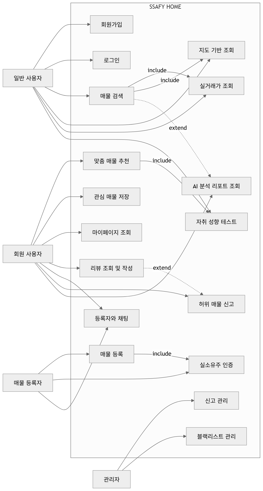
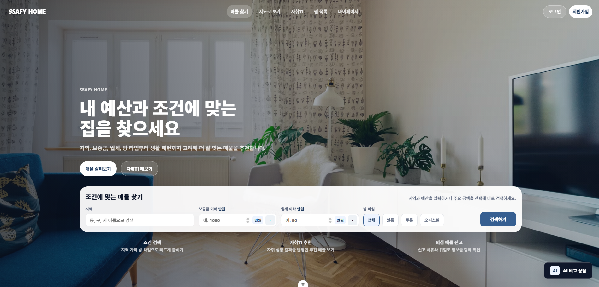
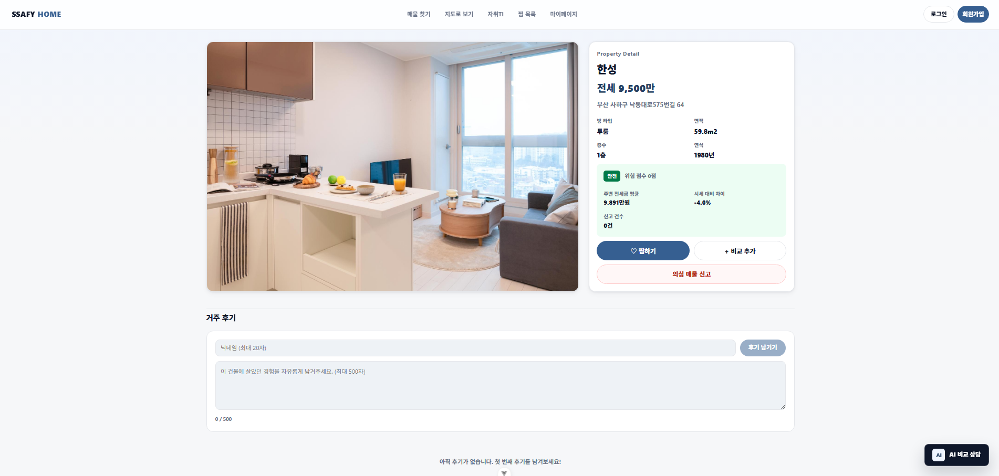
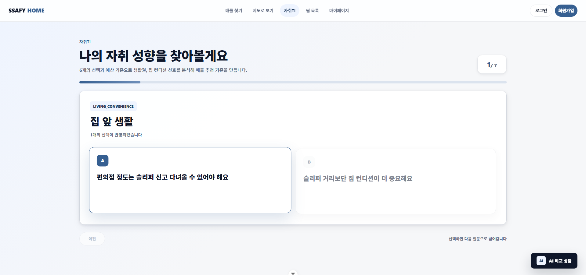
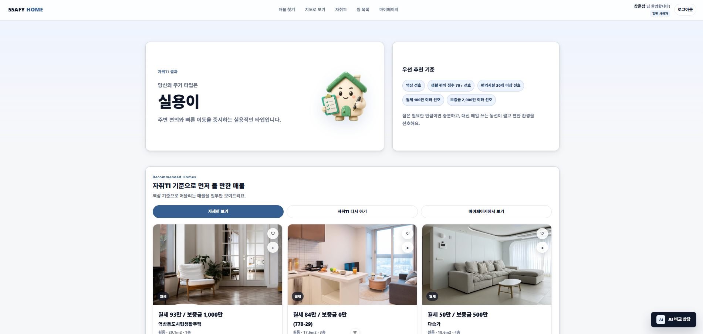
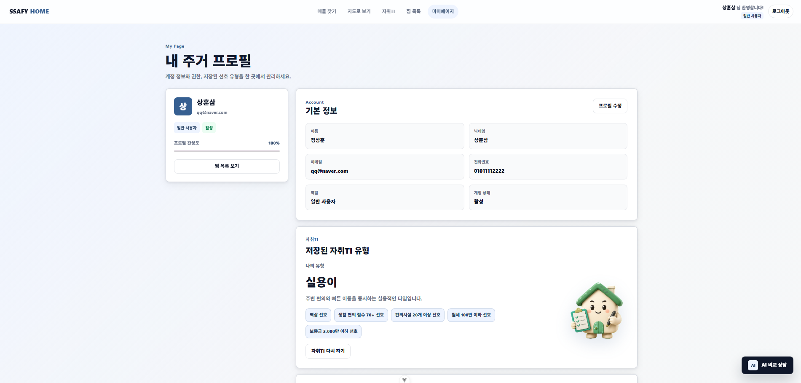

# 두리번

AI 기반 전세사기 예방 및 맞춤형 부동산 추천 플랫폼

---

# 1. 주제 및 아이디어 선정

## 프로젝트 주제

AI 기반 전세사기 예방 및 맞춤형 부동산 추천 플랫폼  
**두리번**

## 프로젝트 배경

최근 전세사기, 허위 매물, 시세 정보 부족 등의 문제로 인해 사회초년생과 대학생 1인 가구의 주거 불안 문제가 증가하고 있다.  
기존 부동산 플랫폼은 단순 매물 검색 중심 기능이 대부분이며, 실제 생활 패턴이나 안전성까지 고려한 정보 제공에는 한계가 존재한다.

이에 따라 본 프로젝트는 다음과 같은 문제를 해결하고자 한다.

- 허위 매물 및 전세사기 위험 예방
- 생활 패턴 기반의 맞춤형 매물 추천
- 실거주 경험 중심의 커뮤니티 제공
- 지도 기반 생활 인프라 시각화 제공

## 프로젝트 아이디어

사용자의 생활 패턴과 선호도를 분석하여 적합한 지역 및 매물을 추천하고,  
실거래가·환경 정보·AI 위험도 분석을 종합 제공하는 부동산 플랫폼을 개발한다.

또한 실소유주 인증 및 신고 이력 기반 위험 분석 기능을 통해  
전세사기 및 허위 매물 피해를 예방하는 것을 목표로 한다.

## 주요 타겟 사용자

- 사회초년생
- 대학생 및 자취생
- 1인 가구
- 전세 및 월세 입주 예정 사용자

---

# 2. 요구사항 명세서

## 2-1. 기능 요구사항

## 실거래가 및 매물 검색

- 공공데이터 기반의 아파트 매매·전월세·다세대주택 실거래가 정보를 조회할 수 있다.
- 검색 결과를 지도 기반으로 시각화하여 제공한다.
- 관심 지역의 실거래가 추이와 평균 시세 정보를 제공한다.
- 매물 상세 페이지에서 실거래가, 주변 상권, 환경 정보 등을 함께 조회할 수 있다.

## 개인 맞춤형 동네/부동산 추천

- 사용자의 생활 패턴과 선호도를 기반으로 맞춤형 매물을 추천한다.
- 직장과의 거리, 자차 보유 여부, 주변 식당 및 편의시설, 역세권 여부, 운동시설 유무 등을 종합하여 생활 적합도 점수를 산출한다.
- 비슷한 생활 패턴을 가진 사용자의 관심 매물 데이터를 기반으로 추천 보조 기능을 제공한다.
- 관심 매물 저장 이력을 기반으로 유사 매물을 추천한다.
- 사용자가 설정한 관심 지역을 우선적으로 추천 및 조회할 수 있다.

## 자취 성향 테스트 및 사용자 유형 추천
사용자의 생활권 선호, 비용 민감도, 집 컨디션 선호를 6개의 A/B 선택 질문으로 분석해 자취TI 유형과 추천 필터를 제공한다.
결과는 매물 추천 점수에 반영되어 생활 패턴에 더 잘 맞는 매물을 우선적으로 보여준다.
### 예시 질문
| 질문 | 선택 A | 선택 B |
| --- | --- | --- |
| 집 앞 생활 | 편의점 정도는 슬리퍼 신고 다녀올 수 있어야 해요 | 슬리퍼 거리보단 집 컨디션이 더 중요해요 |
| 동네 분위기 | 생활 편의시설이 가까우면 괜히 든든해요 | 조용하고 덜 복잡한 동네가 더 편해요 |
| 월세 | 월세는 낮을수록 마음이 편해요 | 마음에 들면 월세는 어느 정도 타협 가능해요 |
| 보증금 | 보증금에 목돈이 많이 묶이는 건 피하고 싶어요 | 조건만 좋다면 보증금은 조금 높아도 괜찮아요 |
| 집 크기 | 집에서는 누울 자리 말고 숨 쉴 자리도 필요해요 | 작아도 깔끔하고 실용적이면 충분해요 |
| 집 상태 | 오래 손 안 봐도 되는 깔끔한 집이 좋아요 | 조금 낡아도 가성비가 좋으면 괜찮아요 |


### 결과 유형
| 유형 | 설명 |
| --- | --- |
| 균형이 | 생활 편의, 비용, 집의 컨디션을 모두 꼼꼼히 보는 타입 |
| 알뜰이 | 편리한 동네와 합리적인 비용을 우선하는 타입 |
| 포근이 | 생활권은 챙기되, 집 안의 쾌적함에 더 크게 반응하는 타입 |
| 실용이 | 주변 편의와 빠른 이동을 중시하는 실용적인 타입 |
| 꼼꼼이 | 지역보다 예산과 집 자체의 만족도를 더 꼼꼼히 보는 타입 |
| 절약이 | 가장 중요한 기준은 무리 없는 주거비인 타입 |
| 공간이 | 동네보다 집 안에서 느끼는 쾌적함을 더 중요하게 보는 타입 |
| 유연이 | 입지, 비용, 크기를 유연하게 비교하며 현실적인 선택을 하는 타입 |

### 기능

- 설문을 통해 사용자의 자취 성향을 분석하여 유형을 분류한다.
- 자취 성향에 맞게 초기 필터링 설정값을 세팅해서 매물을 보여준다.
- 동일한 유형의 사용자가 선호한 지역 및 매물을 추천한다.

## 허위 매물 인증 및 전세사기 방지 시스템

- 매물 등록 시 공공 API를 활용하여 등록자와 실소유주 일치 여부를 검증한다.
- 실소유주 인증 완료 시 인증 마크를 부여한다.
- 실거래가 데이터를 기반으로 시세 이상치를 분석한다.
- 평균 시세 대비 과도하게 낮은 매물에는 ‘주의’ 라벨을 표시한다.
- 신고 이력을 기반으로 중개업자 및 매물 위험도를 산출한다.
- 누적 신고 수 및 허위 매물 이력을 기반으로 블랙리스트 기능을 제공한다.
- AI 기반 분석 리포트를 통해 매물 위험도, 시세 안정성, 주변 환경 등을 종합 분석하여 제공한다.

## 커뮤니티 및 채팅

- 지역 및 매물 기반 커뮤니티 기능을 제공한다.
- 실제 거주 경험이 있는 사용자들의 리뷰를 작성·조회할 수 있다.
- 비슷한 생활 유형의 사용자들이 지역 만족도를 공유할 수 있다.
- 인증 마크가 부여된 매물의 경우 등록자와 실시간 채팅 기능을 제공한다.
- 관심 지역 및 매물 기반 정보 공유 게시판 기능을 제공한다.

## 회원 및 마이페이지

- 조회 사용자와 매물 등록자(소유주·중개업자)의 권한을 분리한다.
- 회원가입, 로그인, 로그아웃 기능을 제공한다.
- 회원은 관심 지역 및 관심 매물을 저장할 수 있다.
- 마이페이지에서 저장한 관심 매물 목록을 조회할 수 있다.
- 사용자의 자취 TI 결과 및 추천 이력을 조회할 수 있다.
- 최근 조회 매물 및 추천 매물 이력을 관리할 수 있다.
- 회원 정보 수정 및 탈퇴 기능을 제공한다.

## 2-2. 비기능 요구사항

- 공공데이터 API 및 지도 API를 활용하여 최신 실거래가 및 지역 정보를 제공한다.
- Spring Framework와 MyBatis 기반의 웹 서비스 구조로 구현한다.
- 웹 브라우저 환경에서 동작하며 반응형 UI를 지원한다.
- 검색 결과 및 추천 데이터는 빠른 응답 속도를 제공해야 한다.
- 대량의 주소 및 실거래 데이터 처리를 위해 Redis 캐싱 및 인덱싱 최적화를 적용한다.
- 회원 인증이 필요한 기능은 로그인 후에만 사용할 수 있다.
- 실시간 채팅 및 사용자 활동 데이터는 안정적으로 처리되어야 한다.
- 지도 및 매물 조회 기능은 모바일 환경에서도 원활하게 동작해야 한다.
- 외부 API 호출 실패 시 예외 처리 및 대체 응답 기능을 제공해야 한다.

## 2-3. 차별점

## 생활 반경 기반 맞춤 추천

- 단순 가격이나 위치 기반 추천이 아니라 사용자의 생활 패턴을 분석하여 직장 거리, 교통수단, 편의시설 접근성 등을 종합한 생활 적합도 점수를 제공한다.

## 사용자 유형 기반 추천 시스템

- 사용자의 생활 성향을 유형화하여 비슷한 유형의 사용자가 선호한 지역과 매물을 추천한다.

## 실거주 경험 기반 커뮤니티

- 실제 거주 경험이 있는 사용자들의 리뷰와 만족도를 기반으로 지역 정보를 제공하여 단순 매물 정보 이상의 참고 지표를 제공한다.

## 허위 매물 및 전세사기 예방 기능

- 실소유주 인증 API, 시세 이상치 탐지, 신고 이력 기반 위험도 분석 등을 통해 허위 매물 및 전세사기를 예방한다.

## 지도 기반 생활 인프라 시각화

- 카카오 지도 API와 공공데이터를 활용하여 주변 상권, 운동시설, CCTV, 환경 정보 등을 직관적으로 시각화한다.

## 관심 매물 기반 추천 확장

- 비슷한 관심 매물을 저장한 사용자 데이터를 기반으로 새로운 추천 매물을 제공하여 사용자 탐색 경험을 확장한다.

## 인증 매물 전용 소통 기능

- 실소유주 인증이 완료된 매물은 등록자와 직접 채팅할 수 있도록 하여 거래 신뢰도를 높인다.

---

# 3. 클래스 다이어그램


---

# 4. 유스케이스 다이어그램



---

# 5. ER 다이어그램


---

# 6. 화면 설계서

## 메인 화면

- 추천 매물 및 인기 지역 조회
- 검색창 및 주요 기능 바로가기 제공
- 사용자 맞춤 추천 영역 제공



## 매물 상세 / 홈 정보 화면

- 실거래가 및 시세 정보 제공
- 주변 인프라 및 환경 정보 시각화
- AI 위험도 분석 리포트 제공



## 자취 성향 테스트 화면

- 생활 패턴 기반 설문 진행
- 사용자 유형 분석 결과 제공
- 유형 기반 추천 필터 적용




## 마이페이지 화면

- 관심 매물 및 관심 지역 관리
- 추천 이력 및 최근 조회 관리
- 회원 정보 수정 기능 제공



---

# 7. REST API 명세서

## 공통 응답 형식

### 성공 응답

```json
{
  "success": true,
  "message": "요청이 성공했습니다.",
  "data": {}
}
```

### 실패 응답

```json
{
  "success": false,
  "message": "에러 메시지",
  "errorCode": "ERROR_CODE"
}
```

## API 목록

| 구분 | Method | URI | 설명 | 인증 |
| --- | --- | --- | --- | --- |
| 인증 | POST | /api/auth/signup | 회원가입 | 불필요 |
| 인증 | POST | /api/auth/login | 로그인 | 불필요 |
| 인증 | POST | /api/auth/logout | 로그아웃 | 필요 |
| 인증 | POST | /api/auth/refresh | 토큰 재발급 | 불필요 |
| 인증 | GET | /api/auth/me | 내 인증 정보 조회 | 필요 |
| 사용자 | GET | /api/users/me | 내 정보 조회 | 필요 |
| 사용자 | PATCH | /api/users/me | 내 정보 수정 | 필요 |
| 사용자 | PATCH | /api/users/me/password | 비밀번호 변경 | 필요 |
| 사용자 | PATCH | /api/users/me/status | 내 계정 상태 변경 | 필요 |
| 사용자 | PATCH | /api/users/me/role | 내 역할 변경 | 필요 |
| 매물 | GET | /api/properties | 매물 목록 조회 | 선택 |
| 매물 | GET | /api/properties/{id} | 매물 상세 조회 | 선택 |
| 매물 | POST | /api/properties | 매물 등록 | 필요 |
| 매물 | PATCH | /api/properties/{propertyId} | 매물 수정 | 필요 |
| 매물 | DELETE | /api/properties/{id} | 매물 삭제 | 필요 |
| 관심 매물 | POST | /api/favorites/{propertyId} | 관심 매물 추가 | 필요 |
| 관심 매물 | DELETE | /api/favorites/{propertyId} | 관심 매물 삭제 | 필요 |
| 관심 매물 | GET | /api/favorites | 내 관심 매물 목록 조회 | 필요 |
| 성향 테스트 | GET | /api/lifestyle/questions | 설문 문항 조회 | 불필요 |
| 성향 테스트 | POST | /api/lifestyle/results/preview | 성향 결과 미리보기 | 불필요 |
| 성향 테스트 | POST | /api/lifestyle/results | 성향 결과 저장 | 필요 |
| 성향 테스트 | GET | /api/lifestyle/results/me | 내 성향 결과 조회 | 필요 |
| 추천 | GET | /api/recommendations | 맞춤 매물 추천 | 필요 |
| 지역 | GET | /api/locations | 지역 검색 | 불필요 |
| AI | POST | /api/ai/chat | AI 채팅 | 선택 |
| AI | POST | /api/ai/compare | AI 매물 비교 | 선택 |
| 위험도 | GET | /api/properties/{propertyId}/risk | 매물 위험도 조회 | 선택 |
| 신고 | POST | /api/properties/{propertyId}/reports | 매물 신고 | 필요 |
| 후기 | GET | /api/properties/{propertyId}/reviews | 매물 후기 조회 | 불필요 |
| 후기 | POST | /api/properties/{propertyId}/reviews | 매물 후기 등록 | 불필요 |
| 관리자 | GET | /api/admin/users | 사용자 목록 조회 | 관리자 |
| 관리자 | GET | /api/admin/users/{userId} | 사용자 상세 조회 | 관리자 |
| 관리자 | PATCH | /api/admin/users/{userId}/status | 사용자 상태 변경 | 관리자 |
| 관리자 | PATCH | /api/admin/users/{userId}/role | 사용자 권한 변경 | 관리자 |
| 관리자 | GET | /api/admin/reports | 신고 목록 조회 | 관리자 |
| 관리자 | GET | /api/admin/reports/{reportId} | 신고 상세 조회 | 관리자 |
| 관리자 | PATCH | /api/admin/reports/{reportId} | 신고 처리 상태 변경 | 관리자 |
